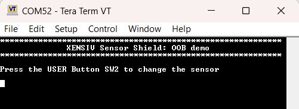
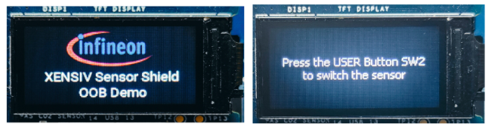
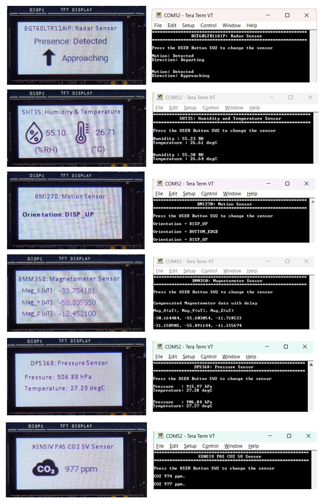

# XENSIV&trade; Sensor Shield: OOB demo

This code example demonstrates how to interface several sensors present on SHIELD_XENSIV_A and display the sensors data on the serial terminal and 0.96-inch ST7735S TFT display present on the shield.

[View this README on GitHub.](https://github.com/Infineon/mtb-example-ce239846-shield-xensiv-a-oob)

[Provide feedback on this code example.](https://cypress.co1.qualtrics.com/jfe/form/SV_1NTns53sK2yiljn?Q_EED=eyJVbmlxdWUgRG9jIElkIjoiQ0UyMzk4NDYiLCJTcGVjIE51bWJlciI6IjAwMi0zOTg0NiIsIkRvYyBUaXRsZSI6IlhFTlNJViZ0cmFkZTsgU2Vuc29yIFNoaWVsZDogT09CIGRlbW8iLCJyaWQiOiJiYW5rYSIsIkRvYyB2ZXJzaW9uIjoiMS4wLjAiLCJEb2MgTGFuZ3VhZ2UiOiJFbmdsaXNoIiwiRG9jIERpdmlzaW9uIjoiTUNEIiwiRG9jIEJVIjoiSUNXIiwiRG9jIEZhbWlseSI6IlBTT0MifQ==)


## Requirements

- [ModusToolbox&trade;](https://www.infineon.com/modustoolbox) v3.1 or later (tested with v3.1)
- [SEGGER AppWizard](https://softwaretools.infineon.com/tools/com.ifx.tb.tool.appwizard) V1.38_6.32 or the version compatible with the used emWin graphics library
- Board support package (BSP) minimum required version: 4.0.0
- Programming language: C
- Associated parts: [PSoC&trade; 62](https://www.infineon.com/cms/en/product/microcontroller/32-bit-psoc-arm-cortex-microcontroller/psoc-6-32-bit-arm-cortex-m4-mcu/psoc-62/)


## Supported toolchains (make variable 'TOOLCHAIN')

- GNU Arm&reg; Embedded Compiler v11.3.1 (`GCC_ARM`) – Default value of `TOOLCHAIN`
- Arm&reg; Compiler v6.22 (`ARM`)
- IAR C/C++ Compiler v9.50.2 (`IAR`)


## Supported Kits (make variable 'TARGET')

- [PSoC&trade; 62S2 Wi-Fi Bluetooth&reg; Pioneer Kit](https://www.infineon.com/CY8CKIT-062S2-43012) (`CY8CKIT-062S2-43012`) – Default value of `TARGET`


## Hardware setup

This example requires XENSIV&trade; Sensor Shield SHIELD_XENSIV_A to be plugged into the supported kit.

**Figure 1. SHIELD_XENSIV_A connected with CY8CKIT-062S2-43012 kit**


This example uses the board's default configuration. See the kit user guide to ensure that the board is configured correctly.


## Software setup

See the [ModusToolbox&trade; tools package installation guide](https://www.infineon.com/ModusToolboxInstallguide) for information about installing and configuring the tools package.

Install a terminal emulator if you don't have one. Instructions in this document use [Tera Term](https://teratermproject.github.io/index-en.html).

This example requires no additional software or tools.


## Using the code example

### Create the project

The ModusToolbox&trade; tools package provides the Project Creator as both a GUI tool and a command line tool.

<details><summary><b>Use Project Creator GUI</b></summary>

1. Open the Project Creator GUI tool.

   There are several ways to do this, including launching it from the dashboard or from inside the Eclipse IDE. For more details, see the [Project Creator user guide](https://www.infineon.com/ModusToolboxProjectCreator) (locally available at *{ModusToolbox&trade; install directory}/tools_{version}/project-creator/docs/project-creator.pdf*).

2. On the **Choose Board Support Package (BSP)** page, select a kit supported by this code example. See [Supported kits](#supported-kits-make-variable-target).

   > **Note:** To use this code example for a kit not listed here, you may need to update the source files. If the kit does not have the required resources, the application may not work.

3. On the **Select Application** page:

   a. Select the **Applications(s) Root Path** and the **Target IDE**.

   > **Note:** Depending on how you open the Project Creator tool, these fields may be pre-selected for you.

   b. Select this code example from the list by enabling its check box.

   > **Note:** You can narrow the list of displayed examples by typing in the filter box.

   c. (Optional) Change the suggested **New Application Name** and **New BSP Name**.

   d. Click **Create** to complete the application creation process.

</details>

<details><summary><b>Use Project Creator CLI</b></summary>

The 'project-creator-cli' tool can be used to create applications from a CLI terminal or from within batch files or shell scripts. This tool is available in the *{ModusToolbox&trade; install directory}/tools_{version}/project-creator/* directory.

Use a CLI terminal to invoke the 'project-creator-cli' tool. On Windows, use the command-line 'modus-shell' program provided in the ModusToolbox&trade; installation instead of a standard Windows command-line application. This shell provides access to all ModusToolbox&trade; tools. You can access it by typing "modus-shell" in the search box in the Windows menu. In Linux and macOS, you can use any terminal application.

The following example clones the "[XENSIV&trade; Sensor Shield: OOB demo](https://github.com/Infineon/mtb-example-ce239846-shield-xensiv-a-oob)" application with the desired name "Sensor_Shield" configured for the *CY8CKIT-062S2-43012* BSP into the specified working directory, *C:/mtb_projects*:

   ```
   project-creator-cli --board-id CY8CKIT-062S2-43012 --app-id mtb-example-ce239846-shield-xensiv-a-oob --user-app-name Sensor_Shield --target-dir "C:/mtb_projects"
   ```

The 'project-creator-cli' tool has the following arguments:

Argument | Description | Required/optional
---------|-------------|-----------
`--board-id` | Defined in the <id> field of the [BSP](https://github.com/Infineon?q=bsp-manifest&type=&language=&sort=) manifest | Required
`--app-id`   | Defined in the <id> field of the [CE](https://github.com/Infineon?q=ce-manifest&type=&language=&sort=) manifest | Required
`--target-dir`| Specify the directory in which the application is to be created if you prefer not to use the default current working directory | Optional
`--user-app-name`| Specify the name of the application if you prefer to have a name other than the example's default name | Optional

<br>

> **Note:** The project-creator-cli tool uses the `git clone` and `make getlibs` commands to fetch the repository and import the required libraries. For details, see the "Project creator tools" section of the [ModusToolbox&trade; tools package user guide](https://www.infineon.com/ModusToolboxUserGuide) (locally available at {ModusToolbox&trade; install directory}/docs_{version}/mtb_user_guide.pdf).

</details>


### Open the project

After the project has been created, you can open it in your preferred development environment.


<details><summary><b>Eclipse IDE</b></summary>

If you opened the Project Creator tool from the included Eclipse IDE, the project will open in Eclipse automatically.

For more details, see the [Eclipse IDE for ModusToolbox&trade; user guide](https://www.infineon.com/MTBEclipseIDEUserGuide) (locally available at *{ModusToolbox&trade; install directory}/docs_{version}/mt_ide_user_guide.pdf*).

</details>


<details><summary><b>Visual Studio (VS) Code</b></summary>

Launch VS Code manually, and then open the generated *{project-name}.code-workspace* file located in the project directory.

For more details, see the [Visual Studio Code for ModusToolbox&trade; user guide](https://www.infineon.com/MTBVSCodeUserGuide) (locally available at *{ModusToolbox&trade; install directory}/docs_{version}/mt_vscode_user_guide.pdf*).

</details>


<details><summary><b>Keil µVision</b></summary>

Double-click the generated *{project-name}.cprj* file to launch the Keil µVision IDE.

For more details, see the [Keil µVision for ModusToolbox&trade; user guide](https://www.infineon.com/MTBuVisionUserGuide) (locally available at *{ModusToolbox&trade; install directory}/docs_{version}/mt_uvision_user_guide.pdf*).

</details>


<details><summary><b>IAR Embedded Workbench</b></summary>

Open IAR Embedded Workbench manually, and create a new project. Then select the generated *{project-name}.ipcf* file located in the project directory.

For more details, see the [IAR Embedded Workbench for ModusToolbox&trade; user guide](https://www.infineon.com/MTBIARUserGuide) (locally available at *{ModusToolbox&trade; install directory}/docs_{version}/mt_iar_user_guide.pdf*).

</details>


<details><summary><b>Command line</b></summary>

If you prefer to use the CLI, open the appropriate terminal, and navigate to the project directory. On Windows, use the command-line 'modus-shell' program; on Linux and macOS, you can use any terminal application. From there, you can run various `make` commands.

For more details, see the [ModusToolbox&trade; tools package user guide](https://www.infineon.com/ModusToolboxUserGuide) (locally available at *{ModusToolbox&trade; install directory}/docs_{version}/mtb_user_guide.pdf*).

</details>


## Operation

1. Connect the board to your PC using the provided USB cable through the KitProg3 USB connector.

2. Open a terminal program and select the KitProg3 COM port. Set the serial port parameters to 8N1 and 115200 baud.

3. Program the board using one of the following:

   <details><summary><b>Using Eclipse IDE</b></summary>

      1. Select the application project in the Project Explorer.

      2. In the **Quick Panel**, scroll down, and click **\<Application Name> Program (KitProg3_MiniProg4)**.
   </details>


   <details><summary><b>In other IDEs</b></summary>

   Follow the instructions in your preferred IDE.
   </details>


   <details><summary><b>Using CLI</b></summary>

     From the terminal, execute the `make program` command to build and program the application using the default toolchain to the default target. The default toolchain is specified in the application's Makefile but you can override this value manually:
      ```
      make program TOOLCHAIN=<toolchain>
      ```

      Example:
      ```
      make program TOOLCHAIN=GCC_ARM
      ```
   </details>

4. After programming, the application starts automatically in 3 seconds (to initialize all the sensors and display present on the SHIELD_XENSIV_A). Confirm that "XENSIV Sensor Shield: OOB demo" is displayed on the serial terminal.

   **Figure 2. Terminal output**

   

5. Observe the startup screen with the Infineon logo on the display and wait for the instructions screen to appear on the display after two seconds.

   **Figure 3. Startup screen on the TFT display**

   

6. Follow the instructions displayed on the screen, and press the user button SW2 on the baseboard to switch between the sensors. The output from the currently active sensor will then be displayed on both the serial terminal and the TFT display.

   The order of sensor switching is as follows:
   - Radar sensor
   - Humidity and temperature sensor
   - Motion sensor
   - Magnetometer sensor
   - Pressure sensor
   - CO2 sensor

   See the [Design and implementation](#design-and-implementation) section for more details.

   **Figure 4** shows the sensor switching.

   **Figure 4. Sensors output on TFT display and serial terminal**

   

> **Note:** Before switching the next sensor, wait until the display shows the current sensor readings. Press the user button (SW2) to switch to next sensor after the current sensor reading are obtained. If the TFT display does not switch to next sensor upon button press, press the Reset button from the baseboard to restart the application.


## Debugging

You can debug the example to step through the code.


<details><summary><b>In Eclipse IDE</b></summary>

Use the **\<Application Name> Debug (KitProg3_MiniProg4)** configuration in the **Quick Panel**. For details, see the "Program and debug" section in the [Eclipse IDE for ModusToolbox&trade; user guide](https://www.infineon.com/MTBEclipseIDEUserGuide).

</details>


<details><summary><b>In other IDEs</b></summary>

Follow the instructions in your preferred IDE.

</details>


## Design and implementation

This example initializes the following sensors that are present within the XENSIV&trade; Sensor Shield SHIELD_XENSIV_A and reads data from the sensors based on the button press event. It displays this sensor data on the TFT display of the XENSIV&trade; Sensor Shield and also on the serial terminal.

### 0.96-inch ST7735S TFT display
- **[emWin graphics library:](https://github.com/Infineon/emwin)** The emWin graphics library is implemented as middleware and has all the graphics functions. In this example, the library manages a display buffer and updates it with the pixel data following the graphics operations performed. See [emWin middleware documentation](https://github.com/Infineon/emwin) on GitHub to understand the structure of the emWin package, supported drivers, and a quick start guide to create and run your first emWin project from scratch. The documentation page also contains configuration details on a wide variety of display drivers provided by emWin.
- **[display-tft-st7735s library:](https://github.com/Infineon/display-tft-st7735s)** The display-tft-st7735s library provides the supporting functions for communicating with the ST7735S display controller. The functions in this library initialize and interface the display using the SPI.
- **Application code:** The application code sets up the FreeRTOS task `tft_task()` and begins the scheduler. The FreeRTOS task calls the AppWizard MainTask() to perform various graphics functions.
- **AppWizard project:** The GUI that is displayed on the screen is designed using the AppWizard software. The code example includes the corresponding AppWizard project. The AppWizard functions `APPW_SetVarData()` and `APPW_SetText()` are used to update the display with the sensor readings.

### BGT60LTR11AIP radar sensor
- [BGT60LTR11AIP](https://www.infineon.com/cms/en/product/sensor/radar-sensors/radar-sensors-for-iot/60ghz-radar/bgt60ltr11aip) is a 60 GHz Doppler radar sensor with built-in antennas. This sensor is by default configured in the autonomous mode to detect the target's presence and the direction of its movement. Target presence and direction (approaching/departing) are detected by reading the Phase detect (PDet) and Target detect (TDet) pins of the radar sensor.

- Based on the TDet and PDet detection, the corresponding LEDs on the XENSIV&trade; Sensor Shield reflect these state changes, providing visual feedback based on the sensor's readings.

  **Table 1. Status of BGT60LTR11AIP radar sensor LEDs**

  LED  |   State  |Description
  :------- |:------- |:------------
  T_DET  |  Off | Target presence not detected
  T_DET  |  On  | Target presence detected
  P_DET  |  Off | Target approaching
  P_DET  |  On  | Target departing

### SHT35 digital humidity sensor
- [SHT35 digital humidity sensor](https://sensirion.com/products/catalog/SHT35-DIS-F) is initialized using an I2C interface. After initialization, it goes into periodic measurement mode using the `mtb_sht3x_start_periodic_measurement()` function to choose the appropriate measurement command based on the provided repeatability and messages per second arguments. Then, it reads the humidity and temperature data from the sensor using the `mtb_sht3x_read()` function.

- [sensor-humidity-sht3x](https://github.com/Infineon/sensor-humidity-sht3x) middleware is used to interface with the PSoC&trade; MCU.

### BMI270 motion sensor
- [BMI270 motion sensor](https://www.bosch-sensortec.com/products/motion-sensors/imus/bmi270) is an ultra-low-power (ULP) inertial measurement unit (IMU) providing a 6-axis sensor that combines a 16-bit tri-axial gyroscope and accelerometer. This sensor is initialized using an I2C interface. The `mtb_bmi270_read()` function is used to read the accelerometer data from the orientation of the baseboard equipped with the XENSIV&trade; Sensor Shield. Change the orientation of the baseboard connected with the shield and observe the orientation data updated on the serial terminal and the TFT display.

- [sensor-motion-bmi270](https://github.com/Infineon/sensor-motion-bmi270) middleware is used to interface with the PSoC&trade; MCU.

### BMM350 magnetometer sensor
- [BMM350 magnetometer sensor](https://www.bosch-sensortec.com/products/motion-sensors/magnetometers/bmm350) is a digital geomagnetic sensor capable of measuring the Earth's magnetic field in three perpendicular axes. It is initialized through an I2C interface and reads the magnetometer data on the X, Y, and Z axes of the baseboard equipped with the XENSIV&trade; Sensor Shield using the `mtb_bmm350_read()` function.

- [sensor-orientation-bmm350](https://github.com/Infineon/sensor-orientation-bmm350) middleware is used to interface with the PSoC&trade; MCU.

### DPS368 pressure sensor
- [XENSIV&trade; DPS368 pressure sensor](https://www.infineon.com/cms/en/product/sensor/pressure-sensors/pressure-sensors-for-iot/dps368) is a miniaturized digital barometric air pressure sensor with ultra-high precision (±2 cm) and low current consumption, capable of measuring both pressure and temperature. It is initialized using an I2C interface and reads the sensor data using the `xensiv_dps3xx_read()` function.

- [sensor-xensiv-dps3xx](https://github.com/Infineon/sensor-xensiv-dps3xx) middleware is used to interface with the PSoC&trade; MCU.


### PASC02 sensor
- [PASCO2 sensor](https://www.infineon.com/cms/en/product/sensor/co2-sensors/pasco2v15) features a small form factor with an accurate and robust performance at ppm level with an accuracy of ±30 ppm ±3% of reading. The XENSIV&trade; PASCO2 sensor integrates a photo-acoustic transducer and a microcontroller that runs ppm calculations. It is initialized using an I2C interface and before reading the sensor data pressure compensation is configured with a default pressure value of 1015 hPa. To read the CO2 values, the `xensiv_pasco2_mtb_read()` function is used. Based on the CO2 ppm values, the baseboard uses the red and green RGB LEDs to indicate the ppm value range. When the ppm value is less than 1000, the green RGB LED is turned on, and when the ppm value exceeds 1000, the red RGB LED is turned on.

- [sensor-xensiv-pasco2](https://github.com/Infineon/sensor-xensiv-pasco2) middleware is used to interface with the PSoC&trade; MCU.


### Resources and settings

**Table 2. Application resources**

 Resource   |  Alias/object           |  Purpose
 :-------   | :----------------       | :------------
 GPIO       | RADAR_SEL               | Output pin to select the onboard BGT60LTR11AIP sensor
 GPIO       | T_DET                   | Input pin for the target detection
 GPIO       | P_DET                   | Input pin for the phase detection
 GPIO       | CYBSP_LED_RGB_GREEN     | Indicates the CO2 ppm value range
 GPIO       | CYBSP_LED_RGB_RED       | Indicates the CO2 ppm value range
 SCB (I2C)  | kit_i2c                 | I2C master driver to communicate with the SHT35 humidity sensor
 SCB (SPI)  | mSPI                    | Driver to communicate with TFT display
 GPIO       | CYBSP_D0                | Output pin for the TFT display data command
 GPIO       | CYBSP_D2                | Output pin for the TFT display reset
 GPIO       | CYBSP_D9                | Output pin to select the TFT display SPI CS
 SCB (UART) | cy_retarget_io_uart_obj | UART HAL object used by retarget-io for the debug UART port
<br>


## Related resources

Resources  | Links
-----------|----------------------------------
Application notes | [AN228571](https://www.infineon.com/AN228571) – Getting started with PSoC&trade; 6 MCU on ModusToolbox&trade; <br>[AN215656](https://www.infineon.com/AN215656) – PSoC&trade; 6 MCU: Dual-CPU system design
Code examples| [Using ModusToolbox&trade;](https://github.com/Infineon/Code-Examples-for-ModusToolbox-Software) on GitHub
Device documentation | [PSoC&trade; 6 MCU datasheets](https://documentation.infineon.com/html/psoc6/bnm1651211483724.html) <br> [PSoC&trade; 6 technical reference manuals](https://documentation.infineon.com/html/psoc6/zrs1651212645947.html)
Development Kits | Select your kits from the [Evaluation board finder](https://www.infineon.com/cms/en/design-support/finder-selection-tools/product-finder/evaluation-board).
Libraries on GitHub | [mtb-pdl-cat1](https://github.com/Infineon/mtb-pdl-cat1) – PSoC&trade; 6 Peripheral Driver Library (PDL)<br> [mtb-hal-cat1](https://github.com/Infineon/mtb-hal-cat1) – Hardware Abstraction Layer (HAL) library <br> [retarget-io](https://github.com/Infineon/retarget-io) – Utility library to retarget STDIO messages to a UART port <br> [FreeRTOS](https://github.com/Infineon/freertos) – A port of FreeRTOS kernel for PSoC&trade; 6 MCUs <br> [SHIELD_XENSIV_A](https://github.com/Infineon/SHIELD_XENSIV_A) – SHIELD_XENSIV_A library
Middleware on GitHub | [emwin](https://github.com/Infineon/emwin) – SEGGER emwin middleware library <br> [psoc6-middleware](https://github.com/Infineon/modustoolbox-software#psoc-6-middleware-libraries) – Links to all PSoC&trade; 6 MCU middleware
Tools  | [ModusToolbox&trade;](https://www.infineon.com/modustoolbox) – ModusToolbox&trade; software is a collection of easy-to-use libraries and tools enabling rapid development with Infineon MCUs for applications ranging from wireless and cloud-connected systems, edge AI/ML, embedded sense and control, to wired USB connectivity using PSoC&trade; Industrial/IoT MCUs, AIROC&trade; Wi-Fi and Bluetooth&reg; connectivity devices, XMC&trade; Industrial MCUs, and EZ-USB&trade;/EZ-PD&trade; wired connectivity controllers. ModusToolbox&trade; incorporates a comprehensive set of BSPs, HAL, libraries, configuration tools, and provides support for industry-standard IDEs to fast-track your embedded application development.

<br>


## Other resources

Infineon provides a wealth of data at [www.infineon.com](https://www.infineon.com) to help you select the right device, and quickly and effectively integrate it into your design.


## Document history

Document title: *CE239846* - *XENSIV&trade; Sensor Shield: OOB demo*

 Version | Description of change
 ------- | ---------------------
 1.0.0   | New code example
<br>

All referenced product or service names and trademarks are the property of their respective owners.

The Bluetooth&reg; word mark and logos are registered trademarks owned by Bluetooth SIG, Inc., and any use of such marks by Infineon is under license.


---------------------------------------------------------

© Cypress Semiconductor Corporation, 2024. This document is the property of Cypress Semiconductor Corporation, an Infineon Technologies company, and its affiliates ("Cypress").  This document, including any software or firmware included or referenced in this document ("Software"), is owned by Cypress under the intellectual property laws and treaties of the United States and other countries worldwide.  Cypress reserves all rights under such laws and treaties and does not, except as specifically stated in this paragraph, grant any license under its patents, copyrights, trademarks, or other intellectual property rights.  If the Software is not accompanied by a license agreement and you do not otherwise have a written agreement with Cypress governing the use of the Software, then Cypress hereby grants you a personal, non-exclusive, nontransferable license (without the right to sublicense) (1) under its copyright rights in the Software (a) for Software provided in source code form, to modify and reproduce the Software solely for use with Cypress hardware products, only internally within your organization, and (b) to distribute the Software in binary code form externally to end users (either directly or indirectly through resellers and distributors), solely for use on Cypress hardware product units, and (2) under those claims of Cypress's patents that are infringed by the Software (as provided by Cypress, unmodified) to make, use, distribute, and import the Software solely for use with Cypress hardware products.  Any other use, reproduction, modification, translation, or compilation of the Software is prohibited.
<br>
TO THE EXTENT PERMITTED BY APPLICABLE LAW, CYPRESS MAKES NO WARRANTY OF ANY KIND, EXPRESS OR IMPLIED, WITH REGARD TO THIS DOCUMENT OR ANY SOFTWARE OR ACCOMPANYING HARDWARE, INCLUDING, BUT NOT LIMITED TO, THE IMPLIED WARRANTIES OF MERCHANTABILITY AND FITNESS FOR A PARTICULAR PURPOSE.  No computing device can be absolutely secure.  Therefore, despite security measures implemented in Cypress hardware or software products, Cypress shall have no liability arising out of any security breach, such as unauthorized access to or use of a Cypress product. CYPRESS DOES NOT REPRESENT, WARRANT, OR GUARANTEE THAT CYPRESS PRODUCTS, OR SYSTEMS CREATED USING CYPRESS PRODUCTS, WILL BE FREE FROM CORRUPTION, ATTACK, VIRUSES, INTERFERENCE, HACKING, DATA LOSS OR THEFT, OR OTHER SECURITY INTRUSION (collectively, "Security Breach").  Cypress disclaims any liability relating to any Security Breach, and you shall and hereby do release Cypress from any claim, damage, or other liability arising from any Security Breach.  In addition, the products described in these materials may contain design defects or errors known as errata which may cause the product to deviate from published specifications. To the extent permitted by applicable law, Cypress reserves the right to make changes to this document without further notice. Cypress does not assume any liability arising out of the application or use of any product or circuit described in this document. Any information provided in this document, including any sample design information or programming code, is provided only for reference purposes.  It is the responsibility of the user of this document to properly design, program, and test the functionality and safety of any application made of this information and any resulting product.  "High-Risk Device" means any device or system whose failure could cause personal injury, death, or property damage.  Examples of High-Risk Devices are weapons, nuclear installations, surgical implants, and other medical devices.  "Critical Component" means any component of a High-Risk Device whose failure to perform can be reasonably expected to cause, directly or indirectly, the failure of the High-Risk Device, or to affect its safety or effectiveness.  Cypress is not liable, in whole or in part, and you shall and hereby do release Cypress from any claim, damage, or other liability arising from any use of a Cypress product as a Critical Component in a High-Risk Device. You shall indemnify and hold Cypress, including its affiliates, and its directors, officers, employees, agents, distributors, and assigns harmless from and against all claims, costs, damages, and expenses, arising out of any claim, including claims for product liability, personal injury or death, or property damage arising from any use of a Cypress product as a Critical Component in a High-Risk Device. Cypress products are not intended or authorized for use as a Critical Component in any High-Risk Device except to the limited extent that (i) Cypress's published data sheet for the product explicitly states Cypress has qualified the product for use in a specific High-Risk Device, or (ii) Cypress has given you advance written authorization to use the product as a Critical Component in the specific High-Risk Device and you have signed a separate indemnification agreement.
<br>
Cypress, the Cypress logo, and combinations thereof, ModusToolbox, PSoC, CAPSENSE, EZ-USB, F-RAM, and TRAVEO are trademarks or registered trademarks of Cypress or a subsidiary of Cypress in the United States or in other countries. For a more complete list of Cypress trademarks, visit www.infineon.com. Other names and brands may be claimed as property of their respective owners.
